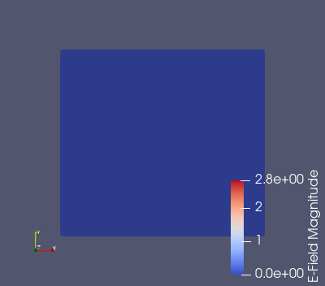

# OpenEMS-Antenna-Simulations
Few months ago I discovered openEMS and play little with it. It was nice, examples were giving some results, but ... I wanted to create some own custom designes and verified that they are right.
Because I know how to design antennas (or at least I thinks so) I know that for this task I want to use CAD to create designs by hand no by code, you can do this for simple shapes, but no for more complicated shapes ie. model of ports, model of more complicated filters and so. For this reason I focused on FreeCAD which has great scripting capabilities.
For now this repository contains just some experimental files which were created on the way how I learned how to simulate basic patch antenna shapes and how to create design in FreeCAD and import it into openEMS.
Hopefully I will create compact example with real results and maybe there would be simple way to create some macro for FreeCAD to generate openEMS simulation file from GUI.

Wilkinson divider, created in FreeCAD, simulated in OpenEMS, Octave script edited manually. Test run:

